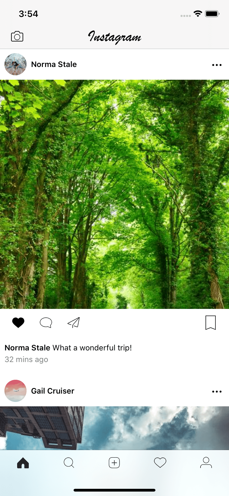
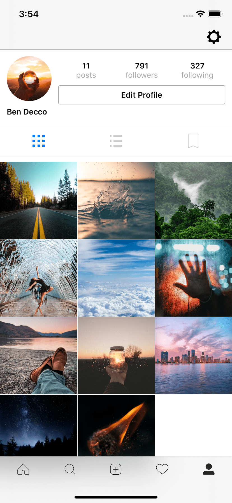
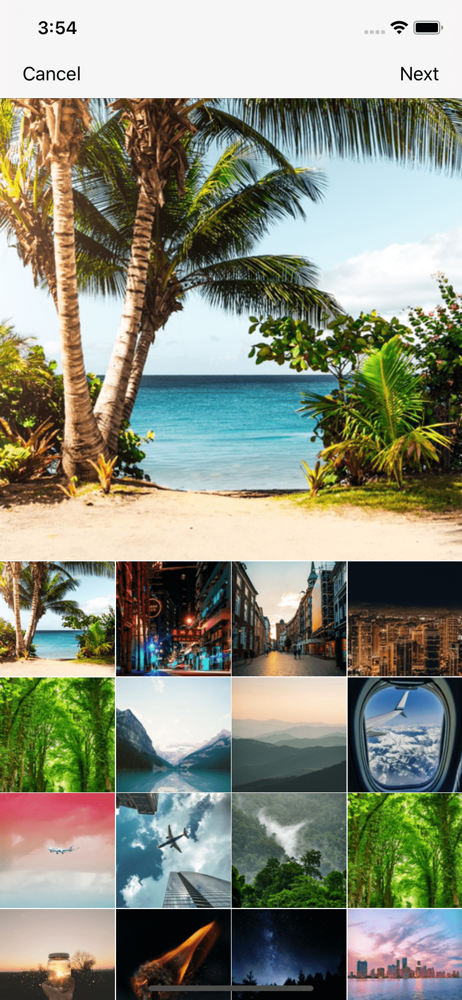
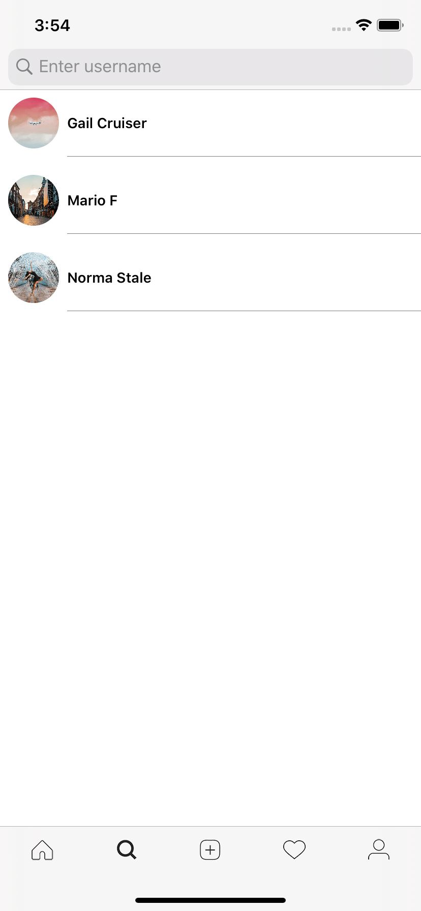

 
# Instagram Clone using Firebase

This app implements the main features of Instagram

[Live demo](https://www.youtube.com/watch?v=CbHlNGV1hzE)

## Features :
  - Login / signup page w/ profile picture from photo library
  - Home Feed w/ posts from followed users
  - User profile w/ posts
  - User profile grid or list view of posts
  - Search users to follow/unfollow and see their posts
  - Follow / unfollow users
  - Post like / dislike
  - Upload a post from photo library
  - Add caption to post
  - List of comments on each post
  - Take photo from live camera

## Screenshots

<table style="width:100%">
  <tr>
    <th>Home Feed </th>
    <th>User Profile</th> 
  </tr>
  <tr>
    <td></td> 
    <td></td> 
  </tr>
    <tr>
    <th>Photo selector for post </th>
    <th>Search for users</th> 
  </tr>
  <tr>
    <td></td> 
    <td></td> 
  </tr>
</table>
